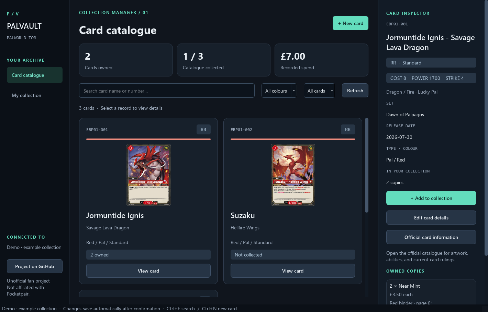
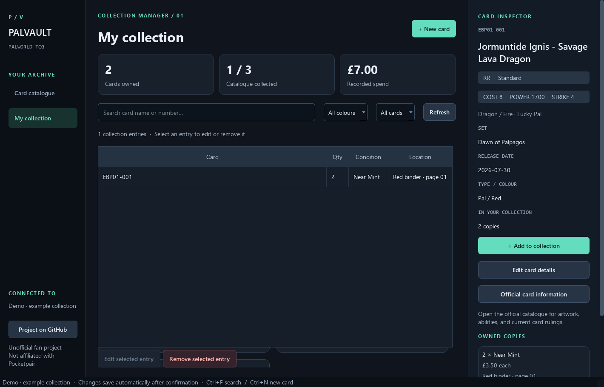
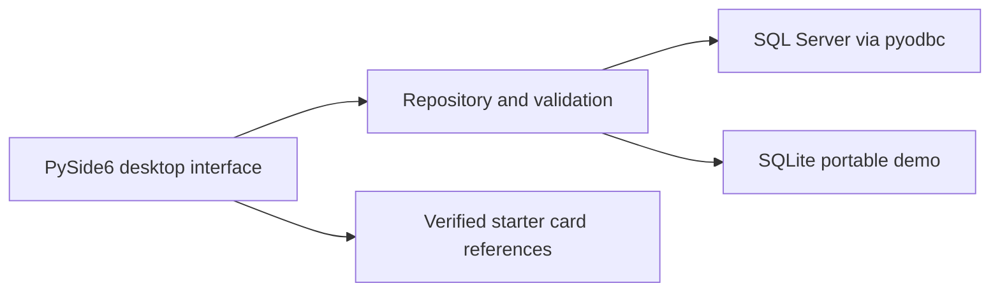
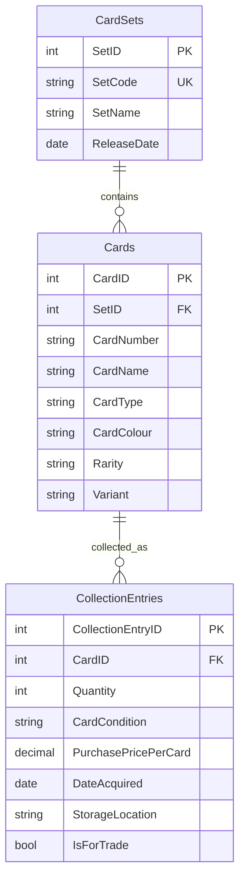

# Palvault · Palworld TCG Collection Manager

[](https://github.com/Lemmyz/palworld-tcg-collection/actions/workflows/tests.yml)

A Python desktop application for browsing Palworld cards and managing a personal
collection. Built with **PySide6, SQL Server, T-SQL, and pyodbc**, with a portable
SQLite demo so employers can evaluate the application without a database server.



## Try it

**Windows:** download the ZIP from [Releases](https://github.com/Lemmyz/palworld-tcg-collection/releases),
extract the entire folder, then open **Palvault.exe**. The default demo stores
changes locally and needs neither Python nor SQL Server. This is an unsigned
portfolio build, not a Microsoft Store application.

**From source** (Python 3.13 recommended):

```powershell
git clone https://github.com/Lemmyz/palworld-tcg-collection.git
cd palworld-tcg-collection
python -m venv .venv
.venv\Scripts\Activate.ps1
python -m pip install -r requirements.txt
python -m palvault
```

On macOS/Linux, activate with `source .venv/bin/activate`. The tested desktop
platform is Windows 11; the portable data layer is cross-platform.

## Features

- Browse cards with artwork, rarity, colour, type, variant, and set information.
- Search by name or card number; filter by colour and ownership.
- Add, edit, and delete catalogue records, with duplicate protection.
- Track multiple collection entries per card: quantity, condition, price per
  copy, acquisition date, storage location, and availability for trade.
- Edit or remove owned copies without deleting the catalogue card.
- View total copies, unique cards collected, and recorded purchase spend.
- View verified cost, power, strike, element, and subtype for the three starter
  cards; open the official catalogue for card text and current rulings.
- Persist changes across restarts. Cancelled dialogs make no changes.
- Keyboard shortcuts: **Ctrl+F** search, **Ctrl+N** new card, **F5** refresh.



### Evaluation walkthrough

1. Open the demo and select **Jormuntide Ignis**.
2. Choose **Add to collection**, enter a quantity and optional purchase details,
   then save. The owned count and totals update immediately.
3. Open **My collection**, select the entry, and edit its quantity or condition.
4. Close and reopen the app to verify persistence.
5. Remove the entry. The catalogue record remains available to collect again.
6. Add your own catalogue card with **New card** and edit its details.

## SQL Server setup

The app connects directly to the original `CardSets`, `Cards`, and
`CollectionEntries` tables.

1. Install SQL Server Express and **Microsoft ODBC Driver 18 for SQL Server**.
2. In SQL Server Management Studio, connect using Windows Authentication and run
   the scripts in `sql/` in numerical order, **01 through 05**.
3. Start the desktop app:

```powershell
python -m palvault --sqlserver
```

For the packaged app, run `Palvault.exe --sqlserver` from its folder. The default
server is `localhost\SQLEXPRESS`, database `PalworldTCG`, with Windows
Authentication. To use another server, set `PALVAULT_CONNECTION_STRING` in the
environment before starting the app. Never commit credentials.

Setup scripts are additive and safe to rerun. Script 05 fills the gap in the
original repository's collection-table setup. Startup does not run SQL Server
migrations or seed data. A failed connection is reported; the app never silently
switches databases. The original CLI reader remains available as `python main.py`.

## Architecture





Two purchases of the same card can have different conditions, prices, and
locations, so catalogue cards and owned copies are separate entities. A
composite unique constraint on set, card number, and variant prevents duplicate
catalogue records. Foreign keys prevent orphaned collection entries. A card
with owned copies cannot be deleted until those entries are removed.

The UI delegates persistence to `palvault/repository.py`. Values use bound query
parameters. Transactions commit complete changes or roll back failures. SQL
joins aggregate owned quantities. Money is validated to two decimal places and
totals use Python `Decimal`; SQL Server stores prices as `DECIMAL(10,2)`.

## Tests and builds

```powershell
python -m pip install -r requirements-dev.txt
python -m pytest -q
```

Tests cover catalogue and collection CRUD, duplicates, invalid input, SQL-like
text values, deletion protection, rollback, persistence, search, form saves,
and cancellation. GitHub Actions runs these tests on Windows.

```powershell
python scripts/check_sqlserver.py
```

The integration check requires permission to create/drop a database. It creates
a uniquely named disposable test database, runs setup twice, checks both CRUD
workflows, then drops that database. It does not change `PalworldTCG`.

Build a Windows executable folder:

```powershell
python -m pip install pyinstaller==6.16.0
./build-windows.ps1
```

The result is `dist/Palvault/`; keep the entire folder together. The manual
**Build Windows app** GitHub Actions workflow produces the same type of build.
Regenerate documentation screenshots with `python scripts/capture_screenshots.py`.
Screenshots use disposable example data, not a private collection.

## Data and current scope

- The catalogue starts with **three cards**, not a full set. Add custom cards
  through the app. New card sets currently require SQL rather than a set editor.
- Demo and SQL Server collections are separate and do not synchronise. On
  Windows, demo data lives at `%LOCALAPPDATA%\Palvault\demo.sqlite3`. Copy it
  while the app is closed to back it up. Override its location using
  `python -m palvault --demo-db path/to/collection.sqlite3`.
- Artwork and reference stats are bundled for the three verified standard
  starter cards. Custom cards show their entered catalogue details.
- Spend means recorded purchase costs in GBP, not market value. The collected
  fraction is relative to the local catalogue, not full-set completion.
- This is a single-user desktop app, with no hosted browser demo or cloud sync.

See [asset provenance and attribution](docs/ASSETS.md). Palvault is an unofficial
fan portfolio project and is not affiliated with Pocketpair or Bushiroad.
